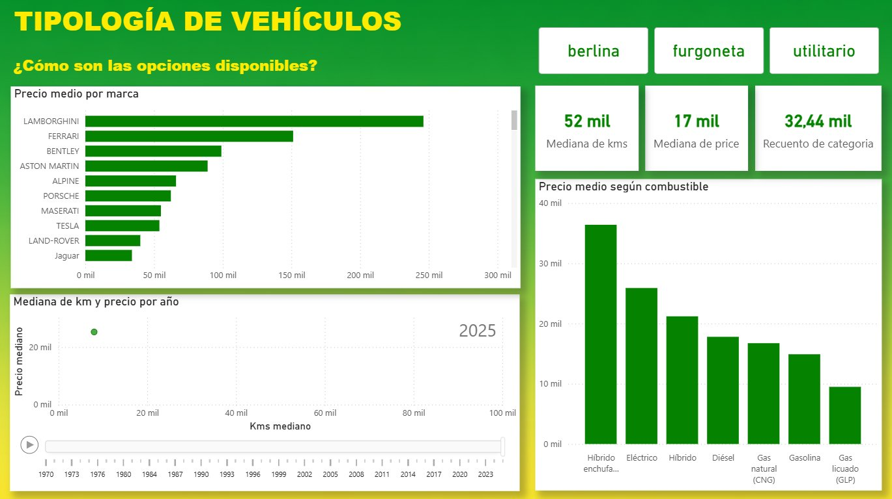
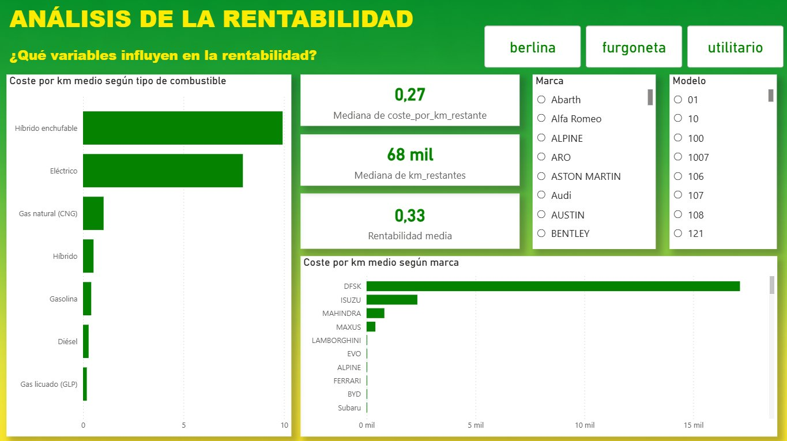
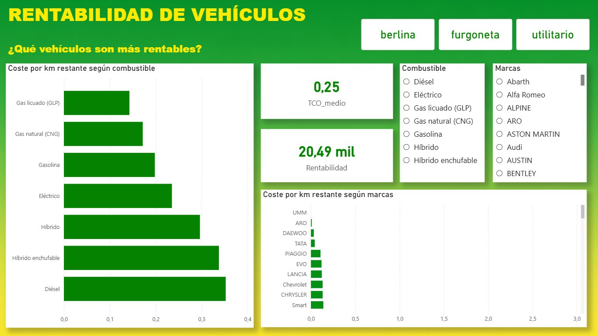
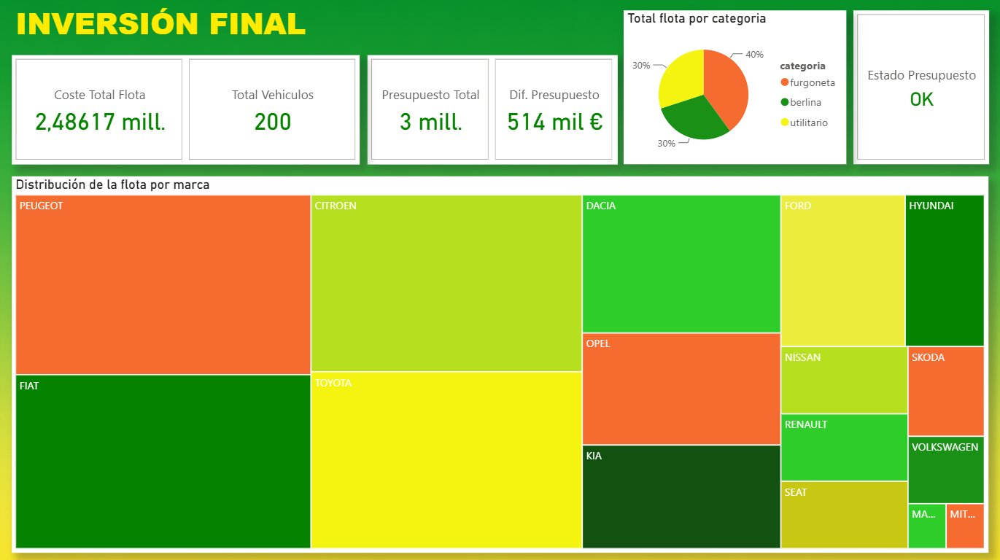

# Power BI — Europcar Fleet Analysis Dashboard

**Project:** Market analysis and fleet design for Europcar  
**Tools:** Power BI · SQL · Python · Dataset of 55,000+ vehicles  
**Context:** Master's Final Project — PontIA, 2026

---

## 🔗 Interactive Dashboard

👉 **[Open live dashboard →](https://app.powerbi.com/view?r=eyJrIjoiNGM3Zjc0YzYtM2M3Yy00NWI3LTllY2YtYzJkYjg0NTUzODMzIiwidCI6IjZhZmVhODVkLWMzMjMtNDI3MC1iNjlkLWE0ZmIzOTI3YzI1NCIsImMiOjl9)**

The dashboard is fully interactive — use the filters (berlina / furgoneta / utilitario) and slicers to explore the data by brand, fuel type, and year.

---

## Business Problem

Europcar needed to optimise its vehicle acquisition strategy under a **€3M budget constraint**, selecting 200 vehicles across three categories (berlina, furgoneta, utilitario) to minimise Total Cost of Ownership (TCO) at 30,000 km/year intensive use.

---

## Dashboard Pages

### 1. Tipología de Vehículos — What options are available?
Explores the market landscape: price by brand, median km and price by year (animated timeline), and price distribution by fuel type.

---

### 2. Análisis de la Rentabilidad — What drives profitability?
Breaks down cost-per-km by fuel type and brand, with interactive brand/model slicers. Key KPIs: median cost per remaining km, median remaining km, average profitability.

---

### 3. Rentabilidad de Vehículos — Which vehicles are most profitable?
Ranks vehicles by cost-per-remaining-km across fuel types and brands. Filterable by combustible and marca to support the final selection decision.

---

### 4. Inversión Final — Final fleet recommendation
Presents the final 200-vehicle fleet selection: total cost (€2.49M vs €3M budget), fleet distribution by category, and breakdown by brand via treemap. Budget status: **OK**, with €514K remaining.

---

## Key Findings

- **Diesel and GLP vehicles** offer the lowest cost-per-remaining-km for intensive fleet use
- **Plug-in hybrids and electric vehicles** have higher acquisition cost but competitive TCO at high mileage
- Final fleet of 200 vehicles was acquired at **€2.49M**, staying €514K under the €3M budget
- Fleet composition: 40% berlina · 30% furgoneta · 30% utilitario

---

## Technical Notes

- Source data: 55,000+ second-hand vehicle listings extracted via web scraping (Python/BeautifulSoup)
- Data cleaning and preparation: Pandas, SQL
- TCO model built in Python, results imported into Power BI via CSV
- Dashboard built with cross-filtering, animated scatter plot (timeline), and treemap visualisation
